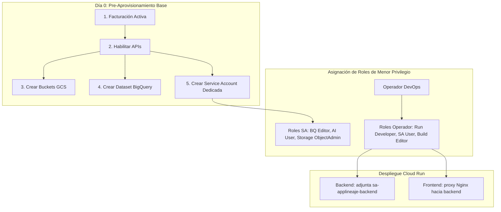

# Plataforma de Linaje End-to-End & Observabilidad en GCP

Plataforma empresarial en Google Cloud Platform (GCP) diseñada para descubrir, correlacionar y visualizar el linaje de datos de extremo a extremo a través de múltiples herramientas heterogéneas on-premise y nube (**Control-M, Shell Scripts, DataStage, Cloud Composer, BigQuery**).

---

## 🏛️ Sistema de Gobernanza y Directrices para Agentes de IA

Este repositorio cuenta con un **sistema de gobernanza exhaustivo** obligatorio para cualquier agente de Inteligencia Artificial (especialmente Google Gemini / Antigravity) y desarrollador. Consulta los documentos maestros:

* 🧭 [**Guía Maestra y Entrypoint (`gemini.md`)**](gemini.md)
* 📜 [**Manifiesto y Reglas Operativas (`workflows/gemini.md`)**](workflows/gemini.md)
* 🧠 [**Memoria y Registro de Decisiones de Arquitectura (`workflows/memory.md`)**](workflows/memory.md)
* 🔒 [**Políticas de Seguridad y RBAC Liverpool (`workflows/security.md`)**](workflows/security.md)
* 🧪 [**Protocolo y Suite de Pruebas (`workflows/testing.md`)**](workflows/testing.md)
* 🎨 [**Estándares de Frontend y UX (`workflows/standards-frontend.md`)**](workflows/standards-frontend.md)
* ⚙️ [**Estándares de Backend y Python (`workflows/standards-backend.md`)**](workflows/standards-backend.md)
* 🏗️ [**Arquitectura Técnica Integral (`workflows/architecture.md`)**](workflows/architecture.md)
* 📖 [**Diccionario de Datos BigQuery (`workflows/data-dictionary.md`)**](workflows/data-dictionary.md)
* 🚀 [**Manual de Despliegue en GCP (`workflows/operations-deployment.md`)**](workflows/operations-deployment.md)

---

## 1. Características Principales

* **Detector Agnóstico de Herramientas:** Reconoce dinámicamente cualquier tecnología por extensión, firmas de contenido o inferencia semántica con IA.
* **Metadata Profunda de BigQuery:** Integra automáticamente el catálogo y linaje de `INFORMATION_SCHEMA.TABLES`, `VIEWS`, `ROUTINES` y `JOBS_BY_PROJECT`.
* **Pipeline en Cascada de 4 Niveles (Optimización de Costes):**
  * **Nivel 1:** Parsers deterministas y AST (`sqlglot`, Python AST, XML).
  * **Nivel 2:** Filtro de relevancia y limpieza del 95% de ruido en logs.
  * **Nivel 3:** Modelo ligero (Gemini 1.5 Flash) con extracción JSON estructurada.
  * **Nivel 4:** Escalado automático a Gemini 1.5 Pro solo para casos complejos.
* **Persistencia Real en BigQuery (`applineajedatos`):**
  * `lineage_nodes`: Catálogo global de componentes.
  * `lineage_edges`: Relaciones y dependencias con scoring de certeza.
  * `execution_status_daily`: Telemetría diaria particionada por fecha.
  * `app_configurations`: Persistencia permanente de parámetros de modelos y buckets entre reinicios de Cloud Run.
* **Documentación Viva de Arquitectura de Código (Dev & Admin):**
  * Grafo interactivo que introspecta en vivo las rutas de FastAPI, servicios, motores de inferencia y vistas React.
  * Selector de rol en tiempo de ejecución para auditar o extender componentes.
* **Experiencia de Usuario Avanzada en Cytoscape.js:**
  * Zoom y scroll suavizados (`wheelSensitivity: 0.12`) con límites estables (`minZoom: 0.25`, `maxZoom: 2.2`).
  * Botón **"Centrar Grafo"** para reencuadrar la vista instantáneamente.
  * Tooltips explicativos con icono **ℹ️** en cada control y semáforo.
  * **Buscador de Entidades con Trazabilidad Bidireccional:** Resalta linaje hacia atrás (**Origen / Upstream**) o hacia adelante (**Destino / Downstream**).
* **Telemetría en Vivo:** Semáforos en tiempo real mediante WebSockets sin recargar la página (🟢 Éxito, 🔵 Ejecutando, 🔴 Fallo, ⚪ Pendiente).

---

## 2. Guía Maestra de Instalación y Despliegue en Nuevos Proyectos de GCP (Principio de Menor Privilegio)

Esta guía detalla el procedimiento completo y exacto para desplegar la plataforma en **cualquier proyecto corporativo de Google Cloud Platform**, cumpliendo con los estándares de ciberseguridad corporativos y evitando terminantemente roles amplios de superadministrador (`roles/owner`, `roles/editor`, `roles/bigquery.admin` o `roles/storage.admin`).

> [!IMPORTANT]
> **Diferenciación Fundamental de Identidades (Dos conceptos completamente diferentes):**
> 1. **Identidad del Operador / Ingeniero DevOps / CI-CD que Despliega:** El usuario o workflow que ejecuta los comandos de compilación y despliegue (`gcloud builds submit`, `gcloud run deploy`).
> 2. **Service Account de Ejecución del Backend (`sa-applineaje-backend`):** La identidad que el contenedor de Cloud Run asume en segundo plano para autenticarse contra BigQuery, Vertex AI y Cloud Storage mediante **Application Default Credentials (ADC)** sin usar llaves JSON ni contraseñas.

---

### 2.1. Estrategia de Menor Privilegio: Pre-Aprovisionamiento (Día 0)

Para evitar que el operador que despliega necesite permisos elevados de administración (`roles/storage.admin` o `roles/bigquery.admin`), la infraestructura base se **pre-aprovisiona una sola vez**. De esta manera, el usuario que compila y despliega solo requiere permisos operativos sobre Cloud Run y Cloud Build.



---

### 2.2. Paso 0: Prerrequisitos Previos de Infraestructura (Día 0)

Ejecute estos comandos en su terminal con una cuenta que tenga permisos de gestión inicial en el proyecto destino:

#### A. Definir Variables del Entorno
```bash
export PROJECT_ID="tu-proyecto-gcp"                     # Identificador del proyecto GCP
export REGION="us-central1"                             # Región para Cloud Run y Storage
export BQ_DATASET="applineajedatos"                     # Dataset maestro de la aplicación
export INBOX_BUCKET="${PROJECT_ID}-inbox"               # Bucket para depositar logs/scripts
export PROCESSED_BUCKET="${PROJECT_ID}-processed"       # Bucket de histórico procesado
export QUARANTINE_BUCKET="${PROJECT_ID}-quarantine"     # Bucket para archivos fallidos
export SA_NAME="sa-applineaje-backend"                  # Nombre de la Service Account
export SA_EMAIL="${SA_NAME}@${PROJECT_ID}.iam.gserviceaccount.com"
```

#### B. Verificar Cuenta de Facturación Activa (Billing)
Cloud Run, Cloud Build, Artifact Registry y Vertex AI exigen obligatoriamente facturación habilitada:
```bash
# Verificar si el proyecto tiene facturación asociada
gcloud billing projects describe "$PROJECT_ID"

# Si no está vinculado, asociar a la cuenta de facturación corporativa:
# gcloud billing projects link "$PROJECT_ID" --billing-account="TU-BILLING-ACCOUNT-ID"
```

#### C. Habilitar APIs Esenciales de GCP
```bash
gcloud services enable \
  run.googleapis.com \
  cloudbuild.googleapis.com \
  artifactregistry.googleapis.com \
  bigquery.googleapis.com \
  storage.googleapis.com \
  aiplatform.googleapis.com \
  logging.googleapis.com \
  pubsub.googleapis.com \
  --project="$PROJECT_ID"
```

> [!NOTE]
> `aiplatform.googleapis.com` es indispensable para que los agentes de Gemini 1.5 Flash y Gemini 1.5 Pro en Vertex AI puedan ser invocados en el pipeline de inferencia semántica.

#### D. Pre-crear Dataset de BigQuery
```bash
bq mk --dataset \
  --location="$REGION" \
  --description="Dataset maestro de linaje, usuarios y configuraciones" \
  "$PROJECT_ID:$BQ_DATASET"
```

#### E. Pre-crear Buckets de Google Cloud Storage
```bash
# Bucket Inbox para ingesta continua
gcloud storage buckets create "gs://$INBOX_BUCKET" \
  --project="$PROJECT_ID" --location="$REGION" --uniform-bucket-level-access

# Bucket Processed para histórico analizado
gcloud storage buckets create "gs://$PROCESSED_BUCKET" \
  --project="$PROJECT_ID" --location="$REGION" --uniform-bucket-level-access

# Bucket Quarantine para anomalías
gcloud storage buckets create "gs://$QUARANTINE_BUCKET" \
  --project="$PROJECT_ID" --location="$REGION" --uniform-bucket-level-access
```

#### F. Crear Service Account Dedicada para el Backend
```bash
gcloud iam service-accounts create "$SA_NAME" \
  --display-name="SA Backend Linaje End-to-End" \
  --project="$PROJECT_ID"
```

---

### 2.3. Paso 1: Configuración de Roles de Menor Privilegio para la Service Account (`sa-applineaje-backend`)

La Service Account que corre el contenedor backend **NO requiere roles Owner ni Editor**. Se le asignan únicamente los roles estrictamente indispensables delimitados por recurso:

```bash
# 1. Nivel Proyecto: Consultas SQL en BigQuery, Inferencia Gemini y Cloud Logging
gcloud projects add-iam-policy-binding "$PROJECT_ID" \
  --member="serviceAccount:$SA_EMAIL" \
  --role="roles/bigquery.jobUser"

gcloud projects add-iam-policy-binding "$PROJECT_ID" \
  --member="serviceAccount:$SA_EMAIL" \
  --role="roles/aiplatform.user"

gcloud projects add-iam-policy-binding "$PROJECT_ID" \
  --member="serviceAccount:$SA_EMAIL" \
  --role="roles/logging.logWriter"

# 2. Nivel Proyecto / Dataset: Permisos de lectura/escritura sobre el Dataset de la App
gcloud projects add-iam-policy-binding "$PROJECT_ID" \
  --member="serviceAccount:$SA_EMAIL" \
  --role="roles/bigquery.dataEditor"

# 3. Nivel Buckets: Permisos de objetos exclusivamente sobre los buckets de la aplicación
gcloud storage buckets add-iam-policy-binding "gs://$INBOX_BUCKET" \
  --member="serviceAccount:$SA_EMAIL" \
  --role="roles/storage.objectAdmin"

gcloud storage buckets add-iam-policy-binding "gs://$PROCESSED_BUCKET" \
  --member="serviceAccount:$SA_EMAIL" \
  --role="roles/storage.objectAdmin"

gcloud storage buckets add-iam-policy-binding "gs://$QUARANTINE_BUCKET" \
  --member="serviceAccount:$SA_EMAIL" \
  --role="roles/storage.objectAdmin"
```

> [!IMPORTANT]
> **Detalle del Permiso para Agentes Gemini:**
> El rol asignado para interactuar con Gemini 1.5 Flash y Pro es estrictamente **`roles/aiplatform.user`** (permiso `aiplatform.endpoints.predict`). Permite invocar predicciones sin facultades para alterar modelos ni administrar recursos de IA. **`roles/aiplatform.admin` está terminantemente prohibido.**

---

### 2.4. Paso 2: Permisos Mínimos Requeridos para el Operador o CI/CD que Despliega

El ingeniero DevOps o cuenta de CI/CD que ejecuta el despliegue **NO necesita ser `Owner` ni `Editor`**. Solo requiere los siguientes 4 roles:

```bash
USER_OR_CICD="user:tu-correo@liverpool.com.mx"

# 1. Administrar y desplegar servicios en Cloud Run (roles/run.developer o roles/run.admin)
gcloud projects add-iam-policy-binding "$PROJECT_ID" \
  --member="$USER_OR_CICD" \
  --role="roles/run.admin"

# 2. Compilar contenedores en Google Cloud Build
gcloud projects add-iam-policy-binding "$PROJECT_ID" \
  --member="$USER_OR_CICD" \
  --role="roles/cloudbuild.builds.editor"

# 3. Subir imágenes Docker a Container Registry / Artifact Registry
gcloud projects add-iam-policy-binding "$PROJECT_ID" \
  --member="$USER_OR_CICD" \
  --role="roles/artifactregistry.writer"

# 4. Autorización para adjuntar la Service Account dedicada al backend (actAs)
# ¡QUIRÚRGICO! Concedido únicamente sobre la Service Account específica, no sobre el proyecto:
gcloud iam service-accounts add-iam-policy-binding "$SA_EMAIL" \
  --member="$USER_OR_CICD" \
  --role="roles/iam.serviceAccountUser"
```

---

### 2.5. Paso 3: Inicialización de Tablas DDL en BigQuery

La plataforma se apoya en 7 tablas maestras en BigQuery. Ejecute el inicializador de base de datos desde el entorno virtual de Python:

```bash
USE_MOCK_GCP=false PYTHONPATH=backend python3 -c "
from app.services.init_db import init_bigquery_tables
res = init_bigquery_tables(project_id='$PROJECT_ID', dataset_id='$BQ_DATASET')
print('Resultado:', res)
"
```

Las 7 tablas aseguradas automáticamente son:
1. `lineage_nodes`: Catálogo maestro de entidades y componentes descubiertos.
2. `lineage_edges`: Relaciones de linaje, scoring de certeza y método de inferencia.
3. `execution_status_daily`: Telemetría diaria y estados de ejecución.
4. `app_configurations`: Configuración persistente (modelos de IA, presupuesto, umbrales).
5. `app_users_roles`: Catálogo corporativo de usuarios RBAC (`@liverpool.com.mx`).
6. `app_model_usage_logs`: Auditoría de consumo de tokens y costos en dólares.
7. `app_errors_log`: Registro enriquecido de incidencias y trazas técnicas.

---

### 2.6. Paso 4: Despliegue de los Servicios en Cloud Run

#### Opción A: Despliegue Automatizado con Script
El repositorio incluye el script parametrizado [`deploy/deploy_gcp.sh`](deploy/deploy_gcp.sh):

```bash
./deploy/deploy_gcp.sh \
  "$PROJECT_ID" \
  "$REGION" \
  "$BQ_DATASET" \
  "$INBOX_BUCKET" \
  "$PROCESSED_BUCKET" \
  "$SA_NAME"
```

#### Opción B: Despliegue Manual Paso a Paso

**1. Compilar y Desplegar Backend FastAPI:**
```bash
# Compilar imagen backend
gcloud builds submit backend --tag "gcr.io/${PROJECT_ID}/applineaje-backend:latest" --project="$PROJECT_ID"

# Desplegar en Cloud Run con Service Account dedicada
gcloud run deploy applineaje-backend \
  --image="gcr.io/${PROJECT_ID}/applineaje-backend:latest" \
  --region="$REGION" \
  --project="$PROJECT_ID" \
  --platform=managed \
  --allow-unauthenticated \
  --service-account="$SA_EMAIL" \
  --set-env-vars="GCP_PROJECT_ID=$PROJECT_ID,BQ_DATASET=$BQ_DATASET,GCS_INBOX_BUCKET=$INBOX_BUCKET,GCS_PROCESSED_BUCKET=$PROCESSED_BUCKET,GCS_QUARANTINE_BUCKET=$QUARANTINE_BUCKET,GCP_SERVICE_ACCOUNT=$SA_EMAIL,USE_MOCK_GCP=false"

# Obtener URL del backend desplegado
BACKEND_URL=$(gcloud run services describe applineaje-backend --region="$REGION" --project="$PROJECT_ID" --format='value(status.url)')
echo "Backend activo en: $BACKEND_URL"
```

**2. Configurar y Desplegar Frontend React (Nginx Reverse Proxy):**
```bash
BACKEND_HOST=$(echo "$BACKEND_URL" | sed -e 's|^[^/]*//||' -e 's|/.*$||')

# Configurar el proxy_pass de Nginx apuntando al host activo del backend
sed -i.bak "s|proxy_pass https://[^;]*;|proxy_pass https://$BACKEND_HOST;|g" frontend/nginx.conf
sed -i.bak "s|proxy_set_header Host [^;]*;|proxy_set_header Host $BACKEND_HOST;|g" frontend/nginx.conf
rm -f frontend/nginx.conf.bak

# Compilar imagen frontend
gcloud builds submit frontend --tag "gcr.io/${PROJECT_ID}/applineaje-frontend:latest" --project="$PROJECT_ID"

# Desplegar en Cloud Run
gcloud run deploy applineaje-frontend \
  --image="gcr.io/${PROJECT_ID}/applineaje-frontend:latest" \
  --region="$REGION" \
  --project="$PROJECT_ID" \
  --platform=managed \
  --allow-unauthenticated

FRONTEND_URL=$(gcloud run services describe applineaje-frontend --region="$REGION" --project="$PROJECT_ID" --format='value(status.url)')
echo "Frontend activo en: $FRONTEND_URL"
```

---

### 2.7. Paso 5: Verificación y Smoke Testing en Producción

Valide empíricamente la operatividad de los servicios:

```bash
# 1. Health Check del Backend vía Frontend Proxy:
curl -s "${FRONTEND_URL}/api/health"
# Respuesta esperada: {"status":"healthy","gcp_project":"...","mode":"GCP_CONNECTED"}

# 2. Validación de Acceso al Dataset de BigQuery:
curl -s -X POST "${FRONTEND_URL}/api/gcp/validate-dataset" \
  -H "Content-Type: application/json" \
  -d "{\"dataset_name\": \"$BQ_DATASET\"}"
# Respuesta esperada: {"is_valid": true, "tables_count": 7}

# 3. Consulta de Grafo de Linaje persistido:
curl -s "${FRONTEND_URL}/api/lineage/graph?min_confidence=0" | jq '{total_nodes, total_edges}'
```

---

### 2.8. Gestión de Secretos y Credenciales: ¿Por qué NO se requiere Secret Manager?

La plataforma implementa la arquitectura recomendada por Google Cloud de **cero secretos almacenados (Secretless Architecture)**:
- **Sin contraseñas ni llaves en disco:** No se generan ni se descargan Service Account Keys (`.json`).
- **Autenticación Nativa por Metadatos:** El backend corre dentro de Cloud Run asumiendo automáticamente la identidad de `sa-applineaje-backend` mediante el servidor de metadatos de GCP (`http://metadata.google.internal`).
- Las librerías cliente (`google-cloud-bigquery`, `google-cloud-storage`, `httpx` hacia Vertex AI) obtienen y rotan automáticamente sus Bearer Tokens cada hora sin intervención manual ni costo adicional de Secret Manager.

---

## 3. Pruebas Locales y Ejecución

### Pruebas Automatizadas
Las pruebas se encuentran en `scriptsPrueba/` y guardan los reportes en `resultadosPrueba/` (ignorado por git):
```bash
./venv/bin/python3 scriptsPrueba/run_all_tests.py
```

### Ejecutar Localmente la Aplicación Completa
```bash
./run_local.sh
```
Abre en tu navegador: **http://localhost:3000**
