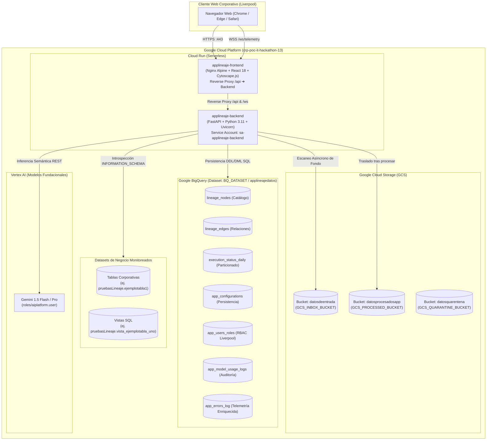
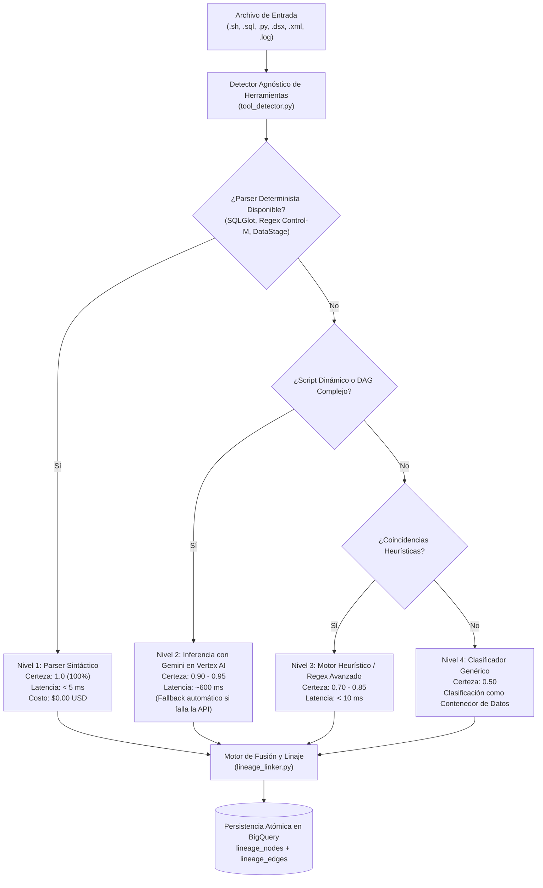
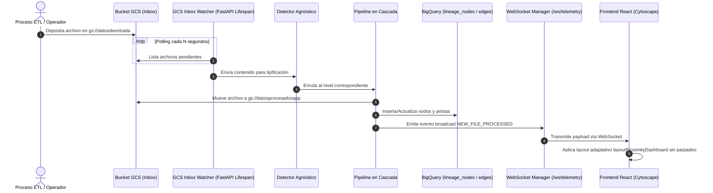

# Arquitectura Técnica Integral: Plataforma de Linaje de Datos GrafoLogsApps

Este documento detalla la **arquitectura técnica global, el modelo C4 de contenedores, los flujos de datos asíncronos y deterministas, la topología en Google Cloud Platform (GCP) y el catálogo funcional de módulos** de la solución.

---

## 1. Visión General de la Solución

GrafoLogsApps es una plataforma empresarial diseñada para reconstruir, visualizar y auditar de forma autónoma el linaje de datos de extremo a extremo a través de múltiples herramientas heterogéneas:
- **Orquestación:** Control-M (XML/CLI), Apache Airflow / Cloud Composer (Python DAGs).
- **Extracción y Procesamiento:** Scripts de Shell (Bash), IBM InfoSphere DataStage (DSX).
- **Almacenamiento y Analítica:** Google BigQuery (tablas maestras de la app, vistas estándar, vistas materializadas y datasets externos).
- **Inteligencia Artificial:** Vertex AI Gemini 1.5 Flash y Pro con fallback transparente a motor heurístico.

---

## 2. Diagrama de Arquitectura de Infraestructura en Google Cloud Platform

---

## 3. Pipeline de Inferencia en Cascada de 4 Niveles

Para garantizar máxima precisión matemática y optimizar al 100% los costos operativos de inteligencia artificial, el procesamiento de archivos se ejecuta mediante un motor en cascada de 4 capas:

---

## 4. Flujo Asíncrono de Ingesta y Notificación en Tiempo Real

---

## 5. Arquitectura de Código del Repositorio

### A. Frontend (`frontend/src/`)
- **`App.tsx`:** Contenedor de la aplicación, barra de navegación corporativa Liverpool y gestión de sesión activa.
- **`components/LineageGraphView.tsx`:** Visualizador de linaje con Cytoscape.js, algoritmo `layoutProximityDashboard`, cajas responsivas y buscador bidireccional.
- **`components/LiveStatusView.tsx`:** Semáforos de telemetría en vivo sincronizados por WebSockets.
- **`components/ArchitectureView.tsx`:** Introspección del propio código con filtrado por capas y módulos.
- **`components/FileDropzoneView.tsx`:** Carga manual y consulta histórica de archivos.
- **`components/UserRolesView.tsx`:** Gestión RBAC de usuarios corporativos `@liverpool.com.mx`.
- **`components/ConfigView.tsx`:** Panel dinámico de configuración en BigQuery y Guía Maestra IAM desplegable.
- **`components/CostsView.tsx`:** Auditoría de costos de IA y control presupuestario mensual.
- **`components/ErrorsView.tsx`:** Consola de incidencias enriquecidas ("carnita") y ciclo de vida de resolución.

### B. Backend (`backend/app/`)
- **`main.py`:** Endpoints REST, WebSockets y background worker asíncrono de GCS.
- **`config.py`:** Pydantic Settings parametrizadas para proyectos GCP, datasets y buckets.
- **`security.py`:** Control de acceso RBAC, dominios Liverpool e inmunidad de `ADMIN_ROOT`.
- **`models/schemas.py`:** Esquemas de datos Pydantic v2 (LineageNode, LineageEdge, User, etc.).
- **`services/bigquery_service.py`:** Acceso a BigQuery con modo dual (`USE_MOCK_GCP`).
- **`services/storage_service.py`:** Abstracción de GCS con mitigación estricta de Path Traversal.
- **`services/init_db.py`:** Aseguramiento idempotente de las 7 tablas maestras en BigQuery.
- **`engine/tool_detector.py`:** Clasificador agnóstico de herramientas.
- **`engine/cascade_pipeline.py`:** Pipeline en cascada de 4 capas y conector Vertex AI.
- **`engine/lineage_linker.py`:** Algoritmo de unión de dependencias cross-tool.
- **`engine/bigquery_metadata.py`:** Recolector de vistas (`INFORMATION_SCHEMA.VIEWS`) con AST SQLGlot.
- **`engine/code_architecture.py`:** Auto-introspección dinámica del código fuente.

---

## 6. Catálogo de los 8 Módulos Web de la Plataforma

| Módulo | Componente React | Roles Autorizados | Funcionalidad Principal |
|--------|------------------|:-----------------:|-------------------------|
| **1. Grafo Linaje** | `LineageGraphView.tsx` | Todos (incluye `Viewer`) | Visualización interactiva con algoritmo de proximidad, filtros de tecnología, buscador con aislamiento bidireccional upstream/downstream y slider de certeza (0% a 100%). |
| **2. Estatus en Vivo** | `LiveStatusView.tsx` | Todos | Monitoreo en tiempo real de la ejecución diaria mediante semáforos (🟢 Éxito, 🔵 Ejecutando, 🔴 Fallo, ⚪ Pendiente) por WebSocket. |
| **3. Arquitectura Viva** | `ArchitectureView.tsx` | `Developer`, `Admin` | Grafo de auto-introspección del código del sistema. Filtra por capa (Frontend/Backend) y módulo web. |
| **4. Bandeja Archivos** | `FileDropzoneView.tsx` | `Data Engineer`, `Admin` | Visor de archivos procesados en GCS y subida manual de scripts para análisis puntual. |
| **5. Usuarios y Roles** | `UserRolesView.tsx` | `Admin` | CRUD administrativo de colaboradores `@liverpool.com.mx` con roles RBAC y blindaje de la cuenta raíz `ADMIN_ROOT`. |
| **6. Configuración** | `ConfigView.tsx` | `Admin` | Gestión dinámica de parámetros en BigQuery: modelos de IA, buckets GCS, validación de datasets y Guía Maestra IAM. |
| **7. Control Costos IA** | `CostsView.tsx` | `Admin`, `Developer` | Auditoría de consumo de tokens y costes en dólares por modelo. Presupuesto mensual configurable en USD con alertas tempranas. |
| **8. Gestión Errores** | `ErrorsView.tsx` | `Admin`, `Developer` | Consola centralizada de incidencias con telemetría enriquecida ("carnita"): stack trace completo, severidad, URL, componente origen y auto-reapertura. |
