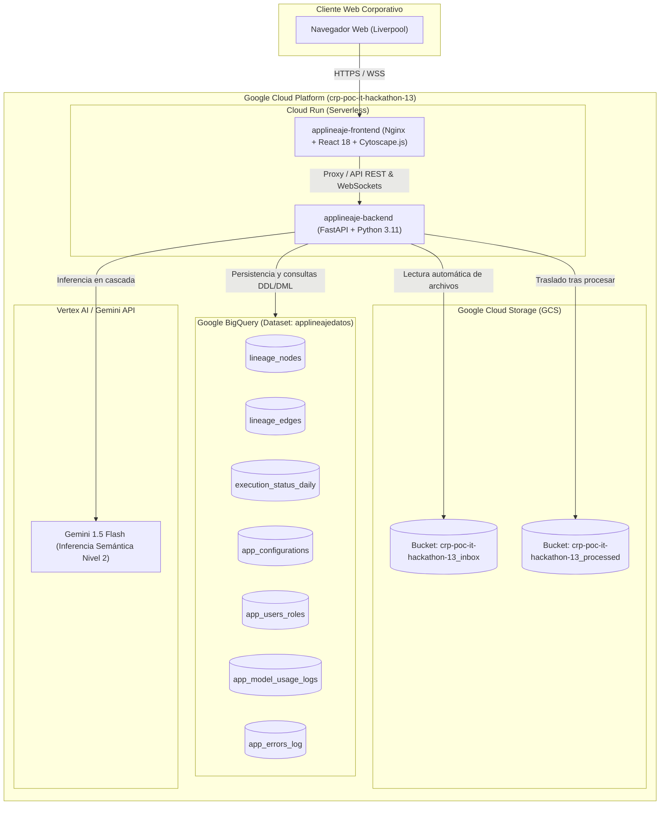
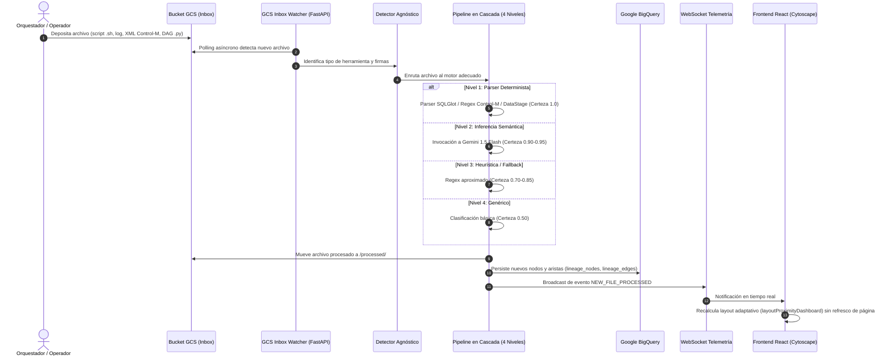

# Arquitectura Técnica Integral: Plataforma de Linaje de Datos GrafoLogsApps

Este documento describe la **arquitectura técnica global, el flujo de datos de extremo a extremo, los componentes de infraestructura en Google Cloud Platform (GCP) y los patrones de integración** de la solución.

---

## 1. Visión General de la Solución

GrafoLogsApps es una plataforma empresarial diseñada para reconstruir, visualizar y auditar de forma autónoma el linaje de datos de extremo a extremo a través de múltiples herramientas heterogéneas:
- **Orquestación:** Control-M (XML/CLI), Apache Airflow / Cloud Composer (Python DAGs).
- **Extracción y Procesamiento:** Scripts de Shell (Bash), IBM InfoSphere DataStage (DSX).
- **Almacenamiento y Analítica:** Google BigQuery (datasets corporativos, vistas y tablas).
- **Inteligencia Artificial:** Google Gemini Flash para inferencia semántica de dependencias complejas.

---

## 2. Diagrama de Arquitectura en Google Cloud Platform

---

## 3. Flujo de Datos End-to-End

---

## 4. Componentes y Módulos del Sistema

### A. Frontend (`frontend/src/`)
- **`App.tsx`:** Contenedor de pestañas (Grafo Linaje, Estatus en Vivo, Arquitectura Viva, Bandeja Archivos, Usuarios y Roles, Configuración, Control Costos IA, Gestión Errores).
- **`components/LineageGraphView.tsx`:** Motor Cytoscape con algoritmos `layoutProximityDashboard`, `dagre`, y `grid`, cajas responsivas y filtrado atómico por tecnología.
- **`components/LiveStatusView.tsx`:** Monitor de ejecución diaria con telemetría en tiempo real vía WebSocket.
- **`components/ArchitectureView.tsx`:** Visualizador de la arquitectura viva auto-introspectada del backend y frontend.
- **`components/FileDropzoneView.tsx`:** Carga manual y consulta del histórico de archivos procesados.
- **`components/UserRolesView.tsx`:** CRUD administrativo de usuarios con RBAC de Liverpool.
- **`components/ErrorsView.tsx`:** Auditoría de errores, contexto enriquecido y resolución de incidencias.
- **`components/CostsView.tsx`:** Monitor de presupuesto de IA y consumo de tokens.

### B. Backend (`backend/app/`)
- **`main.py`:** Endpoints REST, WebSockets `/ws/telemetry` y worker asíncrono de fondo `gcs_inbox_background_watcher`.
- **`engine/tool_detector.py`:** Clasificador agnóstico basado en shebangs, palabras clave y extensiones.
- **`engine/cascade_pipeline.py`:** Pipeline en cascada de 4 niveles con cálculo de scoring de confianza.
- **`engine/lineage_linker.py`:** Motor de resolución de dependencias entre herramientas dispares.
- **`services/bigquery_service.py`:** Capa de datos con queries parametrizadas y emulación en memoria para desarrollo local.
- **`services/storage_service.py`:** Abstracción de GCS con mitigación estricta de Path Traversal.
- **`services/init_db.py`:** DDLs idempotentes con inicialización automática de datasets y tablas.

---

## 5. Módulos Web de la Aplicación (Menú de Navegación)

La aplicación web ofrece 8 módulos especializados diseñados para cubrir las necesidades operativas de ingenieros de datos, arquitectos, administradores y auditores:

| Módulo | Componente React | Roles con Acceso | Funcionalidad Principal |
|--------|------------------|:----------------:|-------------------------|
| **1. Grafo Linaje** | `LineageGraphView.tsx` | Todos (incluye `Viewer`) | Visualización interactiva del grafo end-to-end con layout de proximidad, filtros de tecnología (BigQuery, DataStage, Composer, Control-M, Shell), buscador con aislamiento bidireccional upstream/downstream y slider de certeza (0% a 100%). |
| **2. Estatus en Vivo** | `LiveStatusView.tsx` | Todos | Monitoreo en tiempo real del estado de ejecución diaria de los jobs mediante semáforos (🟢 Éxito, 🔵 Ejecutando, 🔴 Fallo, ⚪ Pendiente) sincronizados por WebSocket. |
| **3. Arquitectura Viva** | `ArchitectureView.tsx` | `Developer`, `Admin` | Grafo de introspección del código fuente del sistema. Permite filtrar por capa (Frontend vs Backend), módulo web, y consultar librerías, endpoints y dependencias activas. |
| **4. Bandeja Archivos** | `FileDropzoneView.tsx` | `Data Engineer`, `Admin` | Visor de archivos procesados en Cloud Storage e interfaz de subida manual de scripts y logs para pruebas puntuales. |
| **5. Usuarios y Roles** | `UserRolesView.tsx` | `Admin` | CRUD administrativo de colaboradores con dominio corporativo `@liverpool.com.mx`. Asignación de roles RBAC, suspensión/reactivación y eliminación con protección blindada para `ADMIN_ROOT`. |
| **6. Configuración** | `ConfigView.tsx` | `Admin` | Parámetros dinámicos de persistencia: selección de modelos de Gemini, configuración y validación de buckets de GCS (inbox/processed), y validación de proyectos GCP monitoreados. |
| **7. Control Costos IA** | `CostsView.tsx` | `Admin`, `Developer` | Auditoría financiera de consumo de tokens y costos en dólares por modelo. Configuración de presupuesto mensual en USD y umbral de alerta porcentual. |
| **8. Gestión Errores** | `ErrorsView.tsx` | `Admin`, `Developer` | Consola de incidencias centralizada con telemetría enriquecida ("carnita"): stack trace completo, severidad, URL, componente origen y ciclo de vida de resolución/auto-reapertura. |

