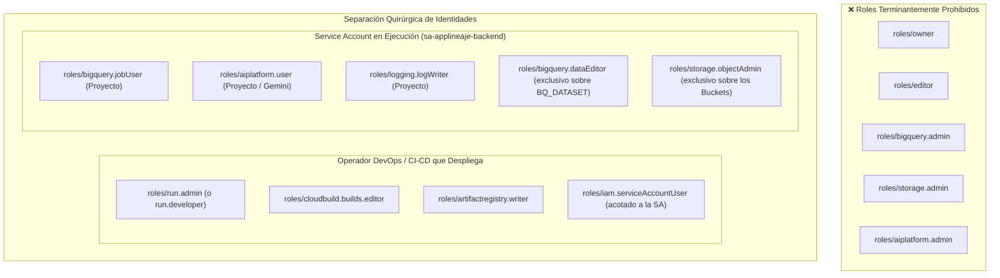

# Políticas de Seguridad, RBAC y Principio de Menor Privilegio IAM: GrafoLogsApps

Este documento establece las **normas de seguridad obligatorias e inquebrantables**, control de acceso basado en roles (RBAC), arquitectura de credenciales y mitigación de vulnerabilidades para toda adición o modificación en la plataforma.

---

## 1. Autenticación y Restricción de Dominio Corporativo (Liverpool)

1. **Aislamiento Exclusivo a `@liverpool.com.mx`:**
   - Todo endpoint protegido y toda verificación de identidad en el backend (`security.py`, `main.py`) debe validar estrictamente que el correo electrónico pertenezca al dominio institucional `@liverpool.com.mx`.
   - Cualquier intento de acceso o registro con dominios públicos (`@gmail.com`, `@hotmail.com`, `@yahoo.com`, `@outlook.com`) o dominios de terceros es rechazado de inmediato con **HTTP 403 Forbidden**.
   - No se permiten comodines (`*`) ni excepciones por lista blanca fuera del dominio institucional.

2. **Modo Invitado / Auto-Registro Seguro:**
   - Cuando un colaborador institucional de Liverpool ingresa por primera vez a la plataforma, se auto-registra automáticamente con el rol **`Viewer`** (Modo Invitado).
   - Este rol otorga exclusivamente acceso de solo lectura al grafo de linaje (`GET /api/lineage/graph`). Cualquier intento de alterar configuraciones, procesar archivos o administrar usuarios es bloqueado con HTTP 403.

---

## 2. Matriz de Roles RBAC y Permisos por Endpoint

| Rol Corporativo | Permisos y Alcance Operativo | Endpoints Autorizados |
|-----------------|------------------------------|-----------------------|
| **`Admin`** (`ADMIN_ROOT`) | Control total del sistema, gestión de usuarios, edición de configuraciones dinámicas, aprobación de presupuestos y visualización de auditoría. | `GET /api/*`, `POST /api/*`, `PUT /api/*`, `DELETE /api/*` |
| **`Developer`** | Acceso a inspección de código, arquitectura viva, monitor de ejecución, reporte de errores y costos de modelos de IA. | `/api/lineage/*`, `/api/telemetry/*`, `/api/architecture/*`, `/api/errors/*`, `/api/costs/*` |
| **`Data Engineer`** | Gestión de cargas de archivos, inspección del pipeline de linaje, revisión de buckets y ejecución manual de scripts. | `/api/lineage/*`, `/api/telemetry/*`, `/api/storage/*`, `/api/gcp/validate-dataset` |
| **`Auditor`** | Consulta de registros de costos de IA, auditoría de consumo de tokens y reportes de ejecución histórica. | `GET /api/costs/*`, `GET /api/lineage/graph`, `GET /api/telemetry/*` |
| **`Viewer`** (Invitado) | Modo consulta básico. Solo visualización e interacción con el lienzo del grafo de linaje. | `GET /api/lineage/graph` |

### Protección Inviolable de la Cuenta Raíz (`ADMIN_ROOT`)
- La cuenta maestra **`aemartinezz@liverpool.com.mx`** cuenta con blindaje criptográfico en el backend:
  - **Prohibido eliminar:** `DELETE /api/users/aemartinezz@liverpool.com.mx` retorna HTTP 400/403.
  - **Prohibido desactivar:** `PUT /api/users/aemartinezz@liverpool.com.mx/status` rechaza cambios a `INACTIVE`.
  - **Prohibido despojar del rol Admin:** `PUT /api/users/aemartinezz@liverpool.com.mx/roles` exige la presencia inmutable del rol `Admin`.

---

## 3. Validación y Sanitización de Entradas

1. **Identificadores de Proyecto de GCP (`project_id`):**
   - Debe cumplir la expresión regular obligatoria:
     ```python
     GCP_PROJECT_REGEX = re.compile(r"^[a-z0-9-]{6,30}$")
     ```
   - Bloquea inyecciones de comandos, caracteres de escape, espacios, barras o comillas.

2. **Nombres de Datasets de BigQuery (`dataset_name`):**
   - Debe cumplir la expresión regular:
     ```python
     BQ_DATASET_REGEX = re.compile(r"^[a-zA-Z0-9_]{1,1024}$")
     ```

3. **Mitigación Estricta de Path Traversal:**
   - En la lectura o manipulación de archivos (`storage_service.py`), ningún nombre de archivo puede contener secuencias de escape como `../`, `..\` o rutas absolutas arbitrarias.
   - Es obligatorio validar:
     ```python
     safe_name = os.path.basename(filename)
     target_path = os.path.abspath(os.path.join(base_dir, safe_name))
     if not target_path.startswith(os.path.abspath(base_dir)):
         raise HTTPException(status_code=400, detail="Evasión de directorio no permitida")
     ```

---

## 4. Gestión de Credenciales y Principio de Menor Privilegio IAM



1. **Separación Quirúrgica de Identidades:**
   - **Operador DevOps / CI-CD:** No tiene acceso de lectura ni escritura a los datos de BigQuery ni a los buckets. Únicamente compila contenedores, despliega el servicio y cuenta con el permiso `roles/iam.serviceAccountUser` delimitado a la Service Account dedicada.
   - **Service Account de Runtime (`sa-applineaje-backend`):** Es la identidad con la que corre el contenedor en Cloud Run. Opera con permisos acotados por recurso y carece de permisos administrativos sobre el proyecto o la IAM.

2. **Permisos de Menor Privilegio para Modelos Gemini (Vertex AI):**
   - **API requerida:** `aiplatform.googleapis.com`.
   - **Rol asignado:** **`roles/aiplatform.user`** (permiso `aiplatform.endpoints.predict`).
   - Permite invocar predicciones e inferencia semántica de linaje sobre Gemini 1.5 Flash y Pro sin facultades para alterar modelos ni administrar recursos de IA.

3. **Arquitectura Secretless (Cero Secretos Almacenados):**
   - **Sin llaves `.json`:** Queda terminantemente prohibido generar o descargar llaves de Service Account (`gcloud iam service-accounts keys create`).
   - **Autenticación Nativa por Metadatos:** En Cloud Run, el backend se autentica automáticamente mediante el servidor interno de metadatos de GCP (`http://metadata.google.internal`).
   - Las librerías de Google Cloud obtienen y rotan automáticamente tokens OAuth Bearer cada hora a costo cero.
   - **No se requiere Google Cloud Secret Manager**, eliminando costes y riesgos de fuga.

---

## 5. Seguridad en Frontend y Cabeceras HTTP

1. **Protección CORS:**
   - En producción, restringir los orígenes permitidos al dominio institucional y al proxy de Nginx de la plataforma.
2. **Encabezados HTTP de Seguridad (Nginx):**
   - `X-Content-Type-Options: nosniff`
   - `X-Frame-Options: DENY`
   - `Strict-Transport-Security: max-age=31536000; includeSubDomains`
   - `Referrer-Policy: strict-origin-when-cross-origin`
